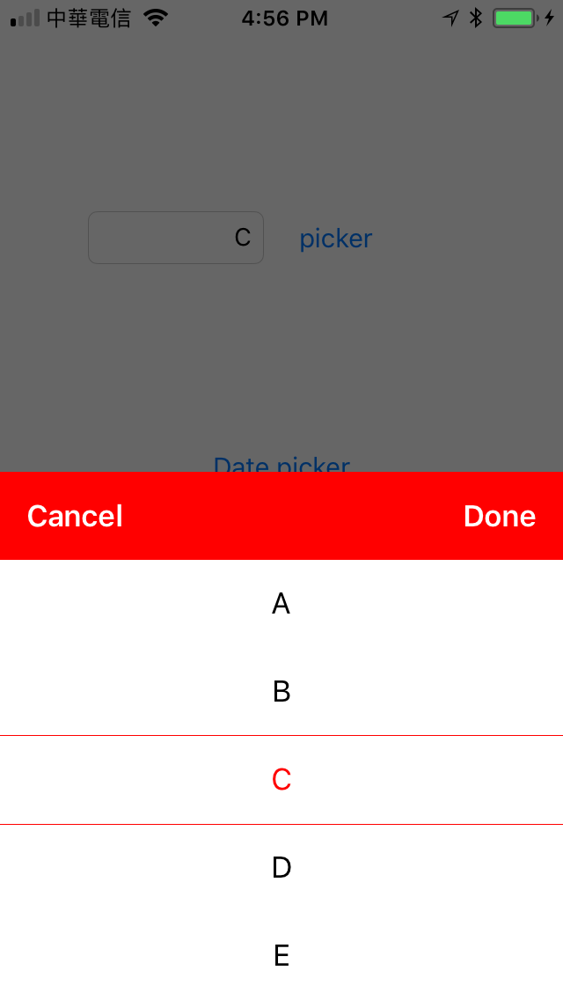
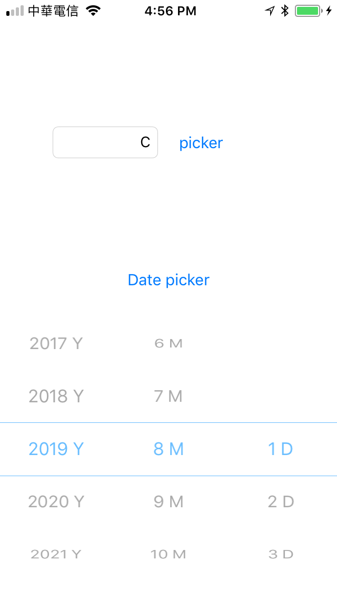

# IRDataPicker 

##### This project is copy and change from PGDatePicker. Implemet custom data picker.

- IRDataPicker is a powerful data picker framework for iOS.

## Features

- Date picker.
- Custom data picker.

## Install
### Cocoapods
- Add `pod 'IRDataPicker'`  in the `Podfile`
- `pod install`

## Usage

- more examples in the demo applications.

### Basic

```obj-c
#import <IRDataPicker/IRDataPicker.h>
```

```obj-c
PGDatePicker *datePicker = [[PGDatePicker alloc]init];
[self.view addSubview:datePicker];

datePicker.selectedDate = ^(NSDateComponents *dateComponents) {
    NSLog(@"dateComponents = %@", dateComponents);
};
```

### Advanced settings
```obj-c
IRDataPickerManager *datePickManager = [[IRDataPickerManager alloc]init];
IRDataPicker *datePicker = datePickManager.datePicker;
datePicker.showUnit = IRShowUnitTypeNone;
datePicker.isHiddenMiddleText = NO;

UIColor *headerColor = [UIColor redColor];

datePickManager.titleLabel.text = @"";
//设置半透明的背景颜色
datePickManager.isShadeBackgroud = true;
//设置头部的背景颜色
datePickManager.headerViewBackgroundColor = headerColor;
//设置线条的颜色
datePicker.lineBackgroundColor = headerColor;
//设置选中行的字体颜色
datePicker.textColorOfSelectedRow = headerColor;
//设置未选中行的字体颜色
datePicker.textColorOfOtherRow = [UIColor blackColor];
//设置取消按钮的字体颜色
datePickManager.cancelButtonTextColor = [UIColor whiteColor];
//设置取消按钮的字
datePickManager.cancelButtonText = @"Cancel";
//设置取消按钮的字体大小
datePickManager.cancelButtonFont = [UIFont boldSystemFontOfSize:17];

//设置确定按钮的字体颜色
datePickManager.confirmButtonTextColor = [UIColor whiteColor];
//设置确定按钮的字
datePickManager.confirmButtonText = @"Done";
//设置确定按钮的字体大小
datePickManager.confirmButtonFont = [UIFont boldSystemFontOfSize:17];
```

## Screenshots


